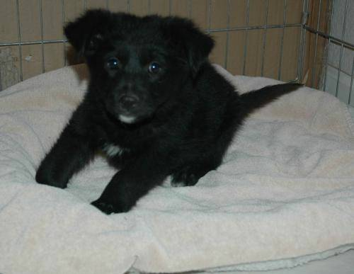

# Dogs-vs-cats classification : training and serving.

We are aiming to implement with Pytorch Dog vs Cat classifier and provide commands to launch server using Docker for deployment.

## Repository Structure

[models/](./models) contains all necessary files for defining models, saved models, and a handler file used for serving.

[parsers/](./parsers) contains parsers for both training and prediction Python scripts.

[serve/](./serve) contains necessary files for model serving using Torchserve and Docker.


## Install required packages

All packages neeeded for running following commands are listed in `requirements.txt`

```bash
pip install requirements.txt
```


## Dataset

In this project, I am using Dogs-vs-Cats Kaggle dataset available at this ([link](https://www.kaggle.com/c/dogs-vs-cats/data)).

Training data is composed of 25000 images of various sizes, 12500 are dog images, 12500 are cat images. Training directory is located at [data/train](./data/train)

Testing data is composed of, and will be used for server inferences. Testing directory is located at [data/test](./data/test1)

Examples of training images :

 

## Train

We finetuned a VGG19 classifier, pretrained on ImageNet dataset of more than 14 million image for classification (20k classes) and adapted for binary classification  ([Pytorch link](https://pytorch.org/vision/main/generated/torchvision.models.vgg19_bn.html))

After 3 epochs, this model reaches an accuracy of around 94% on validation set (10% split).

To run same training procedure that generated saved model, one should run following command :

```bash
python train_main.py --conv_net "vgg" --epoch 3 --validation_split 0.1 --lr 1e-3 --batch_size 32 \
                     --model_path models/model_vgg.pth
```
Train flags stands for:

``--conv_net ``: name that the generated MAR "ready to serve" file will have. \
``--epoch``: it's optional even though it's a nice practice to include the version of the models so as to keep a proper tracking over them.\
``--validation_split``: file where the model architecture is defined.\
``--lr``: the dumped state_dict of the trained model weights.\
``--batch_size``: the Python file which defines the data preprocessing, inference and postprocessing.\
``--model_path``: as this is a classification problem you can include the dictionary/json containing the relationships between the IDs (model's target) and the labels/names and/or also additional files required by the model-file to format the output data in a cleaner way.


During training, at each epoch, if validation loss decreases, model state dictionnary is saved at chosen path (parameter ``model_path``)


## Server

### Using Torchserve

Archiver command : 

```bash
torch-model-archiver --model-name vgg --version 1.0 --model-file models/vgg.py --serialized-file models/model_vgg.pth \
                     --extra-files models/index_to_name.json --handler models/handler.py --export-path serve/model-store -f
```
So torch-model-archiver's used flags stand for:

``--model-name ``: name that the generated MAR "ready to serve" file will have. \
``--version ``: it's optional even though it's a nice practice to include the version of the models so as to keep a proper tracking over them.\
``--model-file``: file where the model architecture is defined.\
``--serialized-file``: the dumped state_dict of the trained model weights.\
``--handler``: the Python file which defines the data preprocessing, inference and postprocessing.\
``--extra-files``: as this is a classification problem you can include the dictionary/json containing the relationships between the IDs (model's target) and the labels/names and/or also additional files required by the model-file to format the output data in a cleaner way.


Server command : 

```bash
torchserve --start --ncs --ts-config serve/config.properties --model-store serve/model-store --models vgg=vgg.mar
```

### Using Docker

Build ubuntu-torchserve image, using files defined in [serve/](./serve)

```bash
docker build -t ubuntu-torchserve:latest deployment/
```
Definition of latest

Launch server

```bash
docker run --rm --name torchserve_docker \
           -p8080:8080 -p8081:8081 -p8082:8082 \
           ubuntu-torchserve:latest \
           torchserve --model-store /home/model-server/model-store/ --models vgg=vgg.mar
```

### Inference

For example to infer the label of the following image, stored in [/data/test1/2124.jpg](/data/test1/2124.jpg), run the following command : 



```bash
curl -X POST http://localhost:8080/predictions/vgg -T dogs-vs-cats/data/test1/2124.jpg
```

This should output the following answer :
 
 `
{
  "dog": 0.9533627033233643
}
`
where label and probability is written in a JSON file.
