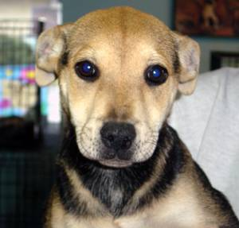

# Dogs-vs-cats classification : training and serving.

This project aims to train and serve Dog vs Cat classifiers, using PyTorch, Torchserve and Docker.

All the command lines listed must be run from root of project.

## Repository Structure

[``models/``](./models) contains all necessary files for  models, saved models, and a handler file used for serving.

[``parsers/``](./parsers) contains parsers for both training and prediction Python scripts.

[``deployment/``](./deployment) contains necessary files and directory for model serving using Torchserve and Docker.

[``dataset.py``](dataset.py) defines dataset preprocessing classes for training.

[``train.py``](train.py) defines training session used in ``train_main.py``.

[``train_main.py``](train_main.py) runs a training session using parsed arguments.

[``predict_main.py``](predict_main.py) runs a simple python prediction script using parsed arguments.


## Install required packages

All packages neeeded for running following commands are listed in `requirements.txt`

```bash
pip install -r requirements.txt
```

## Dataset

This project is using Dogs-vs-Cats Kaggle dataset available at this [link](https://www.kaggle.com/c/dogs-vs-cats/data).

Training data is composed of 25000 images of various sizes, 12500 are dog images, 12500 are cat images. Train images directory is located at [``data/train/``](./data/train)

Testing data is composed of 12500 images, and will be used for server inferences. Test images directory is located at [``data/test1/``](./data/test1)

Examples of training images :

 

## Training

In this project, 2 models are trainable and usable.

- A "basic" CNN  [`base_cnn.py`](./models/base_cnn/base_cnn.py): composed of 4 convolutional blocks (Conv layer, BatchNorm, Relu, Dropout) each followed by a MaxPooling operation (of dimension 2), and of increasing output channels (64, 128, 256, and 512). Final classifier is composed of 1 hidden fully-connected layer of size 100.
- Pretrained VGG19 [`vgg.py`](./models/vgg/vgg.py) : deep VGG convnet, pretrained on ImageNet dataset of more than 14 million image for classification (20k classes). Final classifier is adapted for image binary classification. See this [Pytorch link](https://pytorch.org/vision/main/generated/torchvision.models.vgg19_bn.html) for more complete documentation on pretrained model.

By default, the model is running on a cuda GPU if available, else running on CPU. To change it, edit [`train_main.py`](./train_main.py).

The optimizer chosen in this project is [Adam](https://pytorch.org/docs/stable/generated/torch.optim.Adam.html) optimizer. To change it, edit [`train_main.py`](./train_main.py).

During training, at each epoch, **if validation loss decreases**, model state dictionnary is saved at chosen path (parameter ``model_path``)

### Basic CNN

After 10 epochs, the "basic" CNN model converges and reaches an accuracy of around 87% on validation set (10% split).

To run same training procedure that generated saved model `model_base_cnn.pth`, run the following command :

```bash
python train_main.py --conv_net base_cnn --dropout 0.2 --batch_size 32 \
                     --validation_split 0.1 --lr 1e-3 \
                     --weight_decay 0 --betas 0.9 0.999 --epochs 10 \
                     --model_path models/base_cnn/model_base_cnn.pth
```

### Pretrained VGG

After 3 epochs, the Pretrained VGG model converges and reaches an accuracy of around 94% on validation set (10% split).

To run same training procedure that generated saved model `model_vgg.pth`, run the following command :

```bash
python train_main.py --conv_net vgg --dropout 0.5 --batch_size 32 \
                     --validation_split 0.1 --lr 1e-3 \
                     --weight_decay 0 --betas 0.9 0.999 --epochs 3 \
                     --model_path models/vgg/model_vgg.pth \
```

Train flags stands for:

``--conv_net `` : the alias name of convolutional net to train (`"base_cnn"` for "basic" CNN, `"vgg"` for Pretrained VGG19). \
``--dropout`` : the dropout probability in Conv Net.\
``--batch_size`` : the batch size used for training.\
``--validation_split`` : the validation split rate (0. <= `v` < 1.) .\
``--lr`` : the learning rate.\
``--weigth_decay`` : the weight decay for Adam Optimizer.\
``--betas`` : the betas parameter for Adam Optimizer.\
``--epochs`` : number of epochs of training procedure.\
``--model_path`` : the path to save best model state dictionnary.

## Predicting

In this part, we are using very simple Python script to pass an image to a trained model and outputs both image and predicted label.

Example, using VGG:

```bash
python predict_main.py --conv_net vgg --img_path data/test1/2124.jpg --model_path models/vgg/model_vgg.pth
```

## Server

In this part, we will serve the previously trained and saved models, using [**Torchserve**](https://pytorch.org/serve/). 

To use **Torchserve**, one has to build some key files:

[`handler.py`](models/handler.py) : defines class for data preprocessing, inference, and post-processing. In our case (image classification), this class inherits from standard `ImageClassifier` defined in this [torchserve file](https://github.com/pytorch/serve/blob/master/ts/torch_handler/image_classifier.py). Used for model archive.

[`index_to_name.json`](models/index_to_name.json) : dictionnary to transcript label index to true expected label names. Used for model archive.

[`config.properties`](deployment/config.properties) : store configurations of port adresses for inference, management and metrics. By default, the inference API is listening on localhost port 8080. The management API is listening on port 8081. Both expect HTTP requests. Used for model serving.

[`model-store/`](deployment/model-store/) : directory where MAR "ready to serve" model files are built. Used for model serving.

### Archive model

In this part, we will built ready-to-serve model files, stored as .MAR files.

**This step is not mandatory, as .MAR files are already built in** [**deployment/model-store/**](./deployment/model-store/)

However, one could overwrite model MAR files by first importing [`torch-model-archiver`](https://github.com/pytorch/serve/blob/master/model-archiver/README.md) package.

```bash
pip install torch-model-archiver
```

Then run the following archiver command :

**Base CNN :**

```bash
torch-model-archiver --model-name base_cnn  --version 1.0 --model-file models/base_cnn/base_cnn.py \
                     --serialized-file models/base_cnn/model_base_cnn.pth  --extra-files models/index_to_name.json \
                     --handler models/handler.py --export-path deployment/model-store -f
```

**VGG :**

```bash
torch-model-archiver --model-name vgg  --version 1.0 --model-file models/vgg/vgg.py \
                     --serialized-file models/vgg/model_vgg.pth  --extra-files models/index_to_name.json \
                     --handler models/handler.py --export-path deployment/model-store -f
```
Torch-model-archiver's used flags stand for:

``--model-name ``: name that the generated MAR "ready to serve" file will have. \
``--version ``: it's optional even though it's a nice practice to include the version of the models so as to keep a proper tracking over them.\
``--model-file``: file where the model architecture is defined.\
``--serialized-file``: the dumped state_dict of the trained model weights.\
``--handler``: the Python file which defines the data preprocessing, inference and postprocessing.\
``--extra-files``: as this is a classification problem you can include the dictionary/json containing the relationships between the IDs (model's target) and the labels/names and/or also additional files required by the model-file to format the output data in a cleaner way.\
``--export-path`` : the export path where the MAR file is created.\
``-f`` : forces the export if MAR file alrealdy exists.


### Using only Torchserve
Once models are archived, we can serve them, first using Torchserve.

```bash
torchserve --start --ncs --ts-config deployment/config.properties --model-store deployment/model-store \
           --models vgg=vgg.mar base_cnn=base_cnn.mar
```

Torchserve's used flags stand for:

``--start`` : means that you want to start the TorchServe service (deploy the APIs).\
``--ncs`` : means that you want to disable the snapshot feature (optional).\
``--ts-config`` : to include the configuration file which is something optional too.\
``--model-store`` : is the directory where the MAR files are stored.\
``--models ``: is(are) the name(s) of the model(s) that will be served on the startup, including both an alias which will be the API endpoint of that concrete model and the filename of that model, with format endpoint=model_name.mar.\

### Using Docker

We can do the same in docker.

To pull torchserve docker image, use this command line.

```bash
docker pull pytorch/torchserve
```
To launch docker server container, you can use the following command line :

```bash
docker run --rm -p8080:8080 -p 8081:8081 -p8082:8082 --name torchserve_docker \
           -v $(pwd)/deployment/model-store:/home/model-server/model-store \
           pytorch/torchserve:latest \
           torchserve --model-store /home/model-server/model-store/ --models base_cnn.mar vgg=vgg.mar 
```
where `-v` argument is used to copy the `model-store` directory located in `./deployment` in docker image.

### Inference

Once you have launch server using **Docker** or **Torchserve**, inference of the model is possible.

For example to infer the label of the following image, stored in [/data/test1/2124.jpg](/data/test1/2124.jpg), open a new terminal, go to root of project and run the following command : 


```bash
curl -X POST http://localhost:8080/predictions/base_cnn -T data/test1/2124.jpg
```

This should output the following answer :
 
 `
{
  "dog": 0.8020902276039124
}
`
where label and associated probability is written in a JSON file.

Change `http://localhost:8080/predictions/base_cnn` to `http://localhost:8080/predictions/vgg` to infer predictions with VGG (a bit longer).

To stop **Torchserve** :

```bash
torchserve --stop
```

## Credits

Thanks to this great Git repository [serving-pytorch-models](https://github.com/alvarobartt/serving-pytorch-models) by Álvaro Bartolomé.
